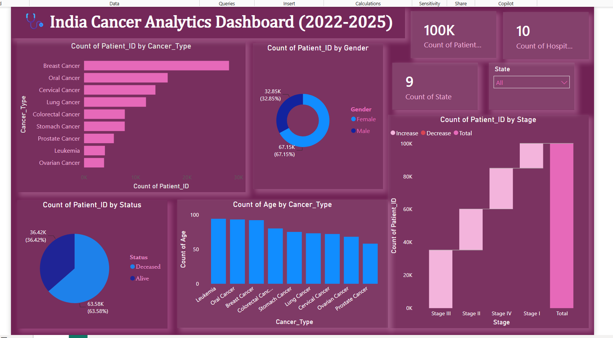

# 🩺 India Cancer Patient Analytics Dashboard (2022–2025)

## 📊 Project Overview

The India Cancer Patient Analytics Dashboard is an interactive Power BI project designed to analyze and visualize cancer patient data across India from 2022 to 2025. The dashboard provides meaningful insights into patient demographics, cancer prevalence, treatment patterns, disease stages, and survival outcomes.

The primary objective of this project is to transform raw healthcare data into actionable insights through effective data cleaning, modeling, and visualization techniques. By leveraging Power BI's interactive capabilities, users can explore trends, compare patient distributions, and gain a deeper understanding of cancer-related healthcare data.

## 🎯 Project Objectives

- Analyze cancer patient demographics across India.
- Identify the most common cancer types.
- Examine stage-wise cancer distribution.
- Understand treatment patterns and patient outcomes.
- Compare survival status among patients.
- Explore state-wise cancer case distribution.
- Build an interactive dashboard for healthcare analytics.
- Demonstrate data visualization and business intelligence skills.

## 📁 Dataset Information

**Dataset Name:** India Cancer Patient Dataset (2022–2025)

The dataset contains patient-level healthcare records including:

- Patient ID
- Age
- Gender
- State
- Cancer Type
- Cancer Stage
- Treatment Type
- Hospital Information
- Diagnosis Date
- Survival Months
- Survival Status

## 🛠️ Tools & Technologies Used

### Data Preparation
- Microsoft Excel
- Data Cleaning
- Data Validation
- Data Transformation

### Data Visualization
- Power BI Desktop
- Power Query Editor
- DAX (Data Analysis Expressions)

### Dashboard Development
- Interactive KPI Cards
- Slicers & Filters
- Bar Charts
- Donut Charts
- Treemap Visuals
- Trend Analysis

## 📈 Dashboard Features

### 🔹 KPI Cards

The dashboard includes key performance indicators such as:

- Total Patients
- Total Hospitals
- Total States
- Survival Rate

These KPIs provide a quick overview of the dataset.

### 🔹 Gender Distribution Analysis

Visualizes the distribution of male and female cancer patients using an interactive donut chart.

**Insight Example:**
- Female patients represent a larger proportion of the dataset compared to male patients.

### 🔹 Cancer Type Analysis

Analyzes the frequency of different cancer types.

**Key Benefits:**
- Identifies the most common cancers.
- Highlights disease prevalence trends.

### 🔹 Stage-wise Analysis

Displays the distribution of patients across:

- Stage I
- Stage II
- Stage III
- Stage IV

This helps evaluate diagnosis patterns and disease progression.

### 🔹 Treatment Type Analysis

Provides insights into treatment methods such as:

- Chemotherapy
- Radiation Therapy
- Surgery
- Immunotherapy

Useful for understanding treatment preferences and healthcare trends.

### 🔹 Survival Status Analysis

Examines patient outcomes using survival status categories:

- Alive
- Deceased

Helps assess overall survival trends within the dataset.

### 🔹 State-wise Analysis

Analyzes cancer patient distribution across Indian states.

This visualization helps identify regions with higher patient concentrations and supports geographical trend analysis.

## 🎨 Dashboard Design Highlights

- Clean and modern healthcare-themed interface
- Interactive filters and slicers
- User-friendly navigation
- Dynamic visualizations
- Professional dashboard layout
- Responsive analytical design

## 🎛️ Interactive Filters

The dashboard includes multiple slicers for dynamic analysis:

- State
- Gender
- Cancer Type
- Stage
- Survival Status

Users can filter data in real-time to explore specific segments of interest.

## 📊 Key Insights Generated

The dashboard helps answer questions such as:

- Which cancer type has the highest number of cases?
- What is the gender distribution of cancer patients?
- Which stage contains the highest patient count?
- What treatment methods are most commonly used?
- How does survival status vary across patient groups?
- Which states report the highest cancer patient volumes?

## 📸 Dashboard Preview

### Main Dashboard

Add your screenshot here:

## 🧠 Skills Demonstrated

This project showcases proficiency in:

- Data Cleaning
- Data Transformation
- Data Modeling
- DAX Calculations
- Healthcare Data Analytics
- Business Intelligence
- Dashboard Design
- Data Storytelling
- Interactive Reporting
- Power BI Development

## 🚀 Future Enhancements

Potential improvements include:

- Predictive Analytics
- Time-Series Analysis
- Advanced DAX Measures
- Geographic Mapping
- Healthcare Trend Forecasting
- Machine Learning Integration

## 👩‍💻 Author

**Harshita Kushwaha**

Aspiring Data Analyst passionate about transforming raw data into actionable insights through analytics, visualization, and business intelligence tools.

### Connect With Me

- LinkedIn: https://www.linkedin.com/in/harshita-kushwaha-28063a333

## ⭐ Support

If you found this project useful, please consider:

⭐ Starring the repository

🔄 Sharing feedback

🤝 Connecting with me on LinkedIn

### Repository Topics

powerbi
data-analytics
business-intelligence
healthcare-analytics
dashboard
data-visualization
excel
dax
powerbi-dashboard
portfolio-project
cancer-analytics
healthcare-dashboard

